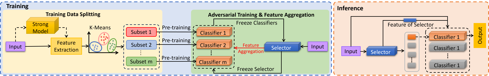

### [DiTMoS: Delving into Diverse Tiny-Model Selection on Microcontrollers]

## Description

This is an implementation example of DiTMoS(server side). DiTMoS is a framework to utilize a set of tiny models to boost the accuracy on time-series mobile applications under comparable memory and latency constraints. 

**Our paper has been submitted to [PerCom'2024](https://www.percom.org/)** .

## Requirements

The DiTMoS code is implemented by:
1. PyTorch v3.10.11
2. SciPy v1.10.1
3. scikit-learn v1.2.2.

## How to Run DiTMoS

The code is an full example of DiTMoS implementation on UniMiB-SHAR dataset which has 17 classes for human activity recognition. The dataset can be found in datasets folder. SInce the UniMiB-SHAR dataset is collected by Matlab, we provide a pre-processing module to convert the Matlab version to python version and split the full dataset to training and test sets as 80%:20%.

1. Run **UniMiB-preprocessing.py** from **pre-processing folder** to create training and testing datasets.
2. Run the **example.py** to implement DiTMoS on the sever and report the final accuracy.

## The Workflow of DiTMoS

As we can see in the DiTMoS workflow, there are four steps to implement DiTMoS framework.
1. Pre-train a strong model which can achieve nearly 95% accuracy on UniMiB-SHAR for data splitting. (The pre-trained model will be saved to **pretrained_model** folder)
2. **Extract the features** of the samples from the strong model and leverage **K-Means clustering** to split the dataset into several subsets. (default setting: 6)
3. Train the classifiers and selector by an **adversarial training** manner. The classifiers and selector will be trained **iteratively**. 
4. Execute inference to test the **performance** of DiTMoS and save the models to saved_model folder. 

We implement the **clustering, adversarial training, and testing** components in DiTMoS folder. The architectures of the strong model, the selector and classifiers are defined in model.py file. The strong model is a **6-layer CNN** while the selector and classifier are both **3-layer CNN** including feature aggregation module. Compared to the best baseline(79%), the default example DiTMoS can achieve **86%** on accuracy. Users can modify the code for their own applications.

## Hardware Inplementation

We test the system performance of DiTMoS on [STM32F767ZI](https://www.st.com/en/microcontrollers-microprocessors/stm32f767zi.html) board using [STM32CubeIDE](https://www.st.com/en/development-tools/stm32cubeide.html) software and [STM32Cube.AI package](https://www.st.com/en/embedded-software/x-cube-ai.html#get-software). To implement the hardware version, you need to convert the model to ONNX format using **torch.onnx.export** command and load the classifiers and the selector to STM32Cube.AI one by one manually. If you want to implement our network slicing strategy, you need to first define the slicing model components and transfer the model parameters to the slicing components. Then implement the slicing models to the hardware. 